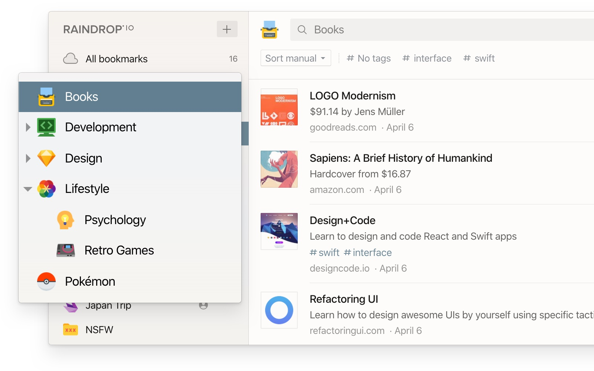

## Introduction
Collections are essentially just folders.
Whether you’re planning a presentation, preparing for an event or creating a website, create a collection so all the important items are saved in one central place.

Each collection have a unique icon selected from thousands searchable icons library.
You can choose view modes to fit your needs better and make your content shine: list, grid, headlines or masonry.

Also, you can choose to hide labels (because sometimes images speak louder than words), drag to reorder your items, or sort your items by date, title, and kind.

Collections and items are **private by default**. It means only can access them. Until you decide to make them public for some persons or entire web.

### Unsorted collection
The `Unsorted` is your default collection in Raindrop.io. When you add an item, it goes straight to your Unsorted unless you specify that the item goes into a specific collection.

### Nested collections
:::note
Nested collections are only available in [Pro plan](../../billing/premium-features.md)
:::
Keep your ever-growing collections list neat and organized with nested collections.
For example, you might create "parent" collection called "Music" and put "Pop", "Rock" and "Electronic" underneath.

You can collapse sub-collections under their “parent” to temporarily hide them from view.
This helps to focus on the right collections at the right time, without getting distracted by everything else.

Nested collections are also a great way to share multiple collections at once. 
When you share a "parent" all of it sub-collections become accessible by collaborators automatically.

### Shared collections

### Public collections

### Groups
Groups help you split your collections list into smaller chunks. 
For example, you might create "Work" and "Home" groups and then organize various collections underneath each one.

## Manage
### Create a collection
.. root or nested

### Change the icon

### Change order
... also how to sort all
... how to nest

### Rename

### Make it public

### Collaborate

### Delete

### Merge
You can merge all items from one collection into another from your dashboard

### Use groups

### Collapse all