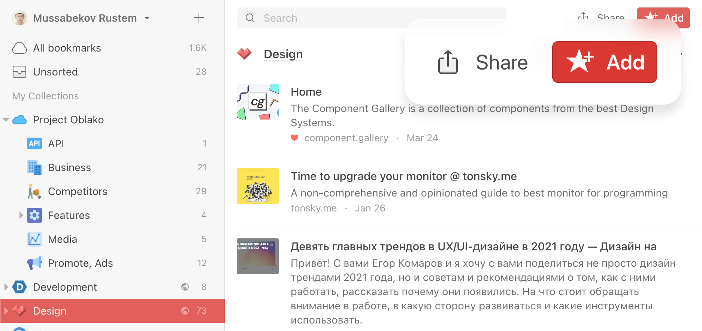

## Introduction

Your collections are private by default, but with one click, you can generate a public link for your collection to share it with anyone.
Anyone with the link will be able to view your wall but not edit it (sign-up is not required).

:::note
If you need to enable edit access just [configure access level](../collaboration/index.md).
:::

## Enable Public Page

1. Open the collection, then click the `Share` in top right corner of the screen.

2. From here just turn on `Public Page` and copy your public page URL

:::note
If you want to embed bookmarks to your website or blog read [this article](../embed/index.md)
:::

## Customize
You can change appearance of your public page by appending special parameters at the end of a URL.

Imagine you have such public page URL: `https://raindrop.io/exentrich/design-66`, just add `/view/...parameters-here...` at the end, so final URL will be for example `https://raindrop.io/exentrich/design-66/view/theme=dark&sort=-title`

Notice that parameter and value is divided by `=`, and each parameter divided by `&`.

Parameter | Possible values | Default | Description
--- | --- | --- | ---
`sort` | `-created`, `created`, `-title`, `title` | `-created` | Bookmarks order
`search` | `#tag` or `apple`, etc... | none | Search query
`theme` | `light`, `dark` or `auto` | `light` | Theme
`page` | `0`, `1`, `2`, etc... | `0` | Pagination
`perpage` | `1`, `2`, ... max `50` | `30` | How many bookmarks per page